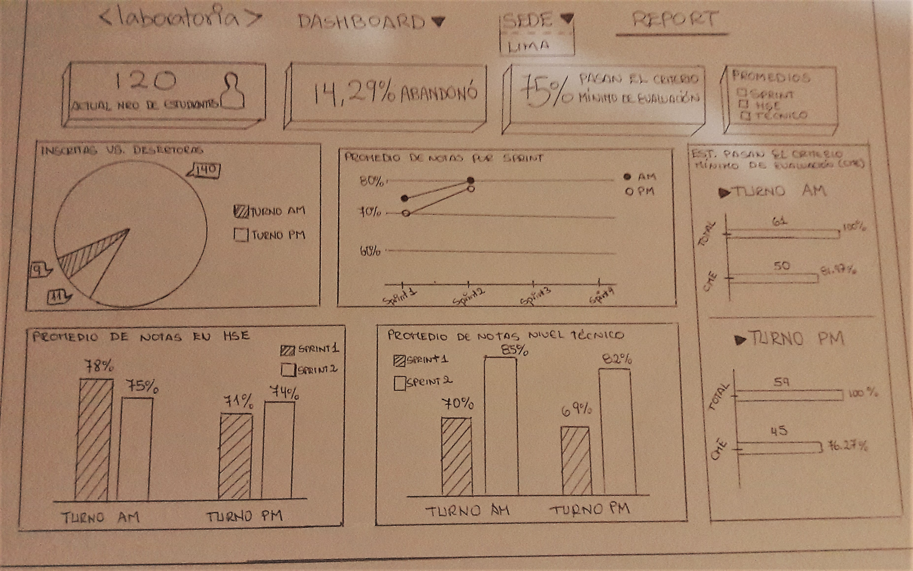

# **UX Challenge #3**
-----

### **Objetivo**

Crear un sketch para la herramienta del ***dashboard*** de Laboratoria.

### **Contenido**

El ***dashboard*** de Laboratoria es una herramienta que permite a los usuarios acceder rápidamente a datos estadísticos en tiempo real como:

- Número de alumnas inscritas.

- Número de alumnas que desertaron.

- Número y % de alumnas que pasan el criterio mínimo de evaluación.

- Promedio de notas por sprint.

- Promedio de notas HSE.

- Promedio de notas técnicas.

Adicionalmente, permite filtrar la data por Sedes (Arequipa, Ciudad de México, Lima y Santiago de Chile).

### **Sketch del Dashboard**

